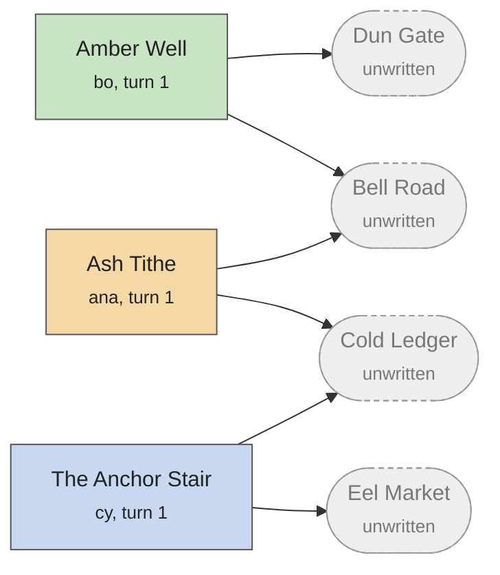

# Example: a lexicon of a river town: who cites whom

Turn 2 of 24: 3 written, 4 unwritten (dashed). An arrow points from an entry to one it cites. Boxes are coloured by author (ana, bo, cy).

```mermaid
flowchart LR
    n_amber_well["Amber Well<br/><small>bo, turn 1</small>"]
    n_ash_tithe["Ash Tithe<br/><small>ana, turn 1</small>"]
    n_the_anchor_stair["The Anchor Stair<br/><small>cy, turn 1</small>"]
    n_dun_gate(["Dun Gate<br/><small>unwritten</small>"])
    n_bell_road(["Bell Road<br/><small>unwritten</small>"])
    n_cold_ledger(["Cold Ledger<br/><small>unwritten</small>"])
    n_eel_market(["Eel Market<br/><small>unwritten</small>"])
    n_amber_well --> n_dun_gate
    n_amber_well --> n_bell_road
    n_ash_tithe --> n_bell_road
    n_ash_tithe --> n_cold_ledger
    n_the_anchor_stair --> n_cold_ledger
    n_the_anchor_stair --> n_eel_market
    classDef a0 fill:#f4d9a6,stroke:#555,color:#222
    classDef a1 fill:#c9e4c5,stroke:#555,color:#222
    classDef a2 fill:#c7d8f0,stroke:#555,color:#222
    classDef phantom fill:#eee,stroke:#999,stroke-dasharray:4 3,color:#777
    class n_amber_well a1
    class n_ash_tithe a0
    class n_the_anchor_stair a2
    class n_dun_gate phantom
    class n_bell_road phantom
    class n_cold_ledger phantom
    class n_eel_market phantom
```
